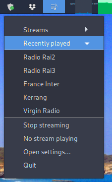
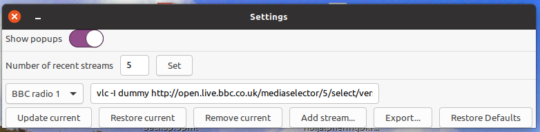

# PyRadio




This is a indicator for the Ubuntu desktop. It's meant to
allow the user to keep his favourite internet streams at hand. It's
written using the PyGObject python module and the AppIndicator API.

It allows to 
- start a stream clicking on one of the labels in the "Streams" menu
- switch to a different stream by clicking on the
corresponding menu entry
- stop the currently playing streaming.

Some settings are available. They allow you to
- turn on/off the notifications coming from the indicator
- set the number of the streams that will be kept in the "Recently
played" menu
- add new streams 
- edit the command used to play existing streams
- export the streams labels and commands to a text file
- undo to changes going back to the default available streams.

In order to start the indicator execute the file
'indicator-pyradio.py'.

If you want the script to be available as an application you can add the
indicator-pyradio.desktop file in ~/.local/share/applications/ with
the following content:

```
[Desktop Entry]
Version=0.1
Name=indicator-pyradio
Comment=My favourite streaming links
Exec=/path/to/the/indicator/folder/indicator-pyradio.py
Icon=/path/to/the/indicator/folder/icons/pyradio.svg
Terminal=false
Type=Application
Categories=Multimedia
```

I've only tested it on my Ubuntu install, I'm on the 20.04

Enjoy!
